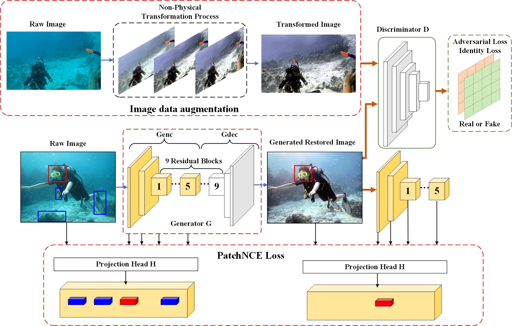

[NPT-UL](https://ieeexplore.ieee.org/document/10423039)  

# NPT-UL: An Underwater Image Enhancement Framework Based on Nonphysical Transformation and Unsupervised Learning

We provide our PyTorch implementation for paper "NPT-UL: An Underwater Image Enhancement Framework Based on Nonphysical Transformation and Unsupervised Learning". NPT-UL is designed for underwater image enhancement, but not limited to it. It performs style-transfer to certain kinds of low-level vision tasks (e.g. Dehaze, Underwater image enhancement, Deraining) while keeping the structure identical.



[//]: # ( width=700)

[//]: # (Before restoration:)

[//]: # ()
[//]: # ()

[//]: # ()
[//]: # (After restoration:)

[//]: # ()
[//]: # ()

### Datasets
UIEB：
Download link: https://paperswithcode.com/dataset/uieb

U45：
Download link: https://github.com/IPNUISTlegal/underwater-test-dataset-U45-

We use the low quality images and recovered images as the unpaired training set (trainA + trainB).

## Prerequisites

```bash
torch>=1.7.1
torchvision>=0.8.2
dominate>=2.4.0
visdom>=0.1.8.8
packaging
GPUtil>=1.4.0
scipy
Pillow>=6.1.0
numpy>=1.16.4
```
For packages, see requirements.txt.

```bash
Run NPTP (C++, opencv) to get high quality training dataset
```

```bash
python train.py --dataroot ./datasets/UIEB --name NPT-UL
```

The checkpoints will be stored at `./checkpoints/NPT-UL`.

- Test the NPT-UL model:
```bash
python test.py --dataroot ./datasets/UIEB --name NPT-UL --preprocess scale_width --load_size 1200
```
The test results will be saved to an html file here: `./results/NPT-UL/latest_test`.

If you use our code/results/dataset, please consider citing our paper. Thanks in advance!
```
@ARTICLE{10423039,
  author={Liang, Dan and Chu, Jiale and Cui, Yuguo and Zhai, Zhanhu and Wang, Dingcai},
  journal={IEEE Transactions on Geoscience and Remote Sensing}, 
  title={NPT-UL: An Underwater Image Enhancement Framework Based on Nonphysical Transformation and Unsupervised Learning}, 
  year={2024},
  volume={62},
  number={},
  pages={1-19},
  keywords={Image color analysis;Image enhancement;Unsupervised learning;Adaptation models;Generative adversarial networks;Data models;Visualization;Contrast learning;nonphysical transformation (NPT);underwater image processing;unsupervised model},
  doi={10.1109/TGRS.2024.3363037}
  }
 ```
If you use something included in CUT, you may also cite [CUT](https://arxiv.org/pdf/2007.15651).

